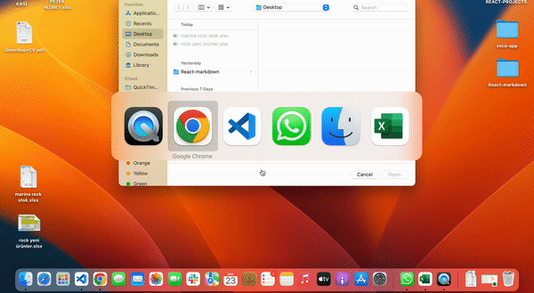

# Markdown Editor with Create React App

In this project, I made a markdown editor.

## Live Link of the Project

[Markdown Editor](https://vsco-app-clone.netlify.app/)

Tools 🛠️

- React
- ContextAPI
- React Copy to Clipboard
- React Markdown

## Badges

## Demo 

